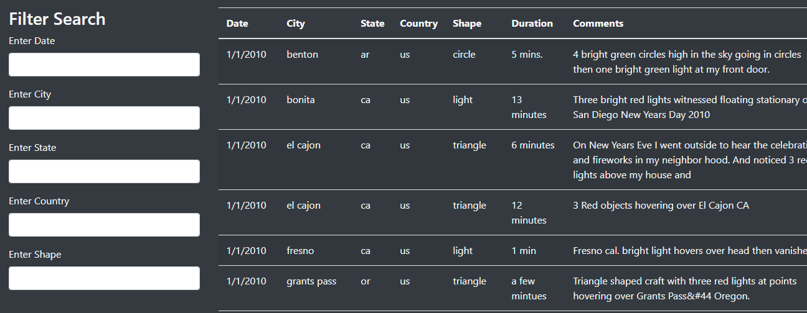

# Overview of Project: 
Dana, a data journalist, has been given the opportunity to write about the topic UFOs. McMinnville is famous for its sightings and even has a 
gathering of UFO enthusiasts. 

She has a JavaScript file with sighting information like countries, cities, states, and type of sighting.

Dana's plan is use to first use JavaScript to display the data as a table. 

JavaScript provides a way to manipulate the data by adding filters. Data needs to add more than one filters.
Addionally, sinc her articles are to be published online, Dana wants to put everything together in a tidy HTML page. Her article, the table of 
data to support her findings, and easy to use filters to fine tune her results.

# Results

On the UFO Sightings webpage, you can view the desired results in a table. One can search the results basis the various fileters on the page, 
e.g., date, city, country, state and shape.

# Summary: 

- Drawback
	- The design is not very attractive. By adding more pictures, bootstrap and css elements, the page could have looked a lot better.
	
- Two Recomendations
	- The design could have been better with more use of bootstap and css
	- There could be more images attached to make the webpage look prettier